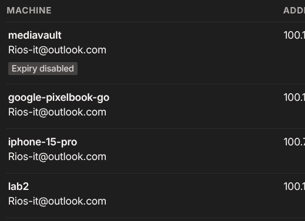

# 02 — Install Tailscale on Linux (DigitalOcean Droplet)

## Outcome
The droplet is connected to your tailnet with a 100.x.x.x Tailscale IP
and visible to all your other devices.

## Prerequisites
- Droplet running and accessible via SSH (see 01-provision-droplet.md)
- Tailscale account at tailscale.com

## Steps

### 1. Install Tailscale
```bash
curl -fsSL https://tailscale.com/install.sh | sh
```

### 2. Connect to your tailnet
```bash
sudo tailscale up
```
Open the authentication URL in a browser on any device and sign in.

### 3. Verify
```bash
tailscale status
```
Another verification method is to look for device in Tailscale console which is beneficial as expiry length can be changed if needed. 


Droplet should appear with a 100.x.x.x IP.





## Troubleshooting
- **Service not running:** `sudo systemctl start tailscaled`
- **Auth URL expired:** run `sudo tailscale up` again for a fresh link

## What broke
