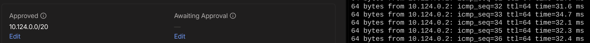

# 04 — Subnet Routing (DigitalOcean VPC)
 
## Outcome
Your droplet advertises its DigitalOcean private VPC subnet to the tailnet.
Other tailnet devices can route traffic into the droplet's cloud network
without any firewall changes.
 
## Relation to Actual Production Environments
This is the same pattern enterprise customers use to expose a cloud VPC
to their team. Instead of opening firewall ports or running a site-to-site
VPN, the subnet router node handles all routing transparently.
 
## Prerequisites
- Droplet connected to tailnet (see 02-install-tailscale-linux.md)
- Access to Tailscale admin console
 
## Steps
 
### 1. Find your VPC subnet
```bash
ip route show
# Look for a line like: 10.x.x.x/20 dev eth1
# Mine was 10.124.0.0/20 dev eth 1
```
 
### 2. Enable IP forwarding
```bash
echo 'net.ipv4.ip_forward = 1' | sudo tee -a /etc/sysctl.d/99-tailscale.conf
echo 'net.ipv6.conf.all.forwarding = 1' | sudo tee -a /etc/sysctl.d/99-tailscale.conf
sudo sysctl -p /etc/sysctl.d/99-tailscale.conf
```
 
### 3. Advertise the route
```bash
sudo tailscale up --advertise-routes=10.YOUR.VPC.0/20
```
 Mine

```bash
sudo tailscale up --advertise-routes=10.124.0.0/20
```


### 4. Approve in the admin console
Machines → [your droplet] → three-dot menu → Edit route settings → enable subnet.
 
### 5. Verify from another device
```bash
ping 10.YOUR.VPC.X   
ping 10.124.0.1 #Mine
```
 
> If other device is Linux, run the following to enable autodiscovery of not only tailscale routes `sudo tailscale set --accept-routes
`


## Troubleshooting
- **Route not working after approval:** `sysctl net.ipv4.ip_forward` should return 1
- **Route shows pending in console:** refresh the admin console page
## What broke
I was unable to ping the forwarded routes from my media vault server. Upon further reading of the deocumentation [https://tailscale.com/docs/features/subnet-routers] I found I had to enable automatic discovery by running the following `sudo tailscale set --accept-routes` once done no issues 


