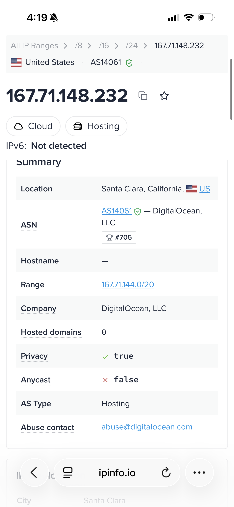

# 05 — Exit Node

## Outcome
The droplet routes all internet traffic for other tailnet devices.
Devices using it as an exit node will appear to the internet as coming
from the droplet's DigitalOcean IP address.

## Steps

### 1. Advertise as exit node
```bash
sudo tailscale up --advertise-routes=10.YOUR.VPC.0/20 --advertise-exit-node
```
my example

```bash
sudo tailscale up --advertise-routes=10.141.0.0/16 --advertise-exit-node
```

### 2. Approve in the admin console
Same flow as subnet routing — approve the exit node under Edit route settings.

### 3. Enable on a client device
- **macOS:** Tailscale menu bar → Use exit node → select your droplet
- **iOS:** Tailscale app → your droplet → Use as exit node

### 4. Verify
Verified exit node with online IP checked from other tailscale client (iOS)



## Troubleshooting
- **Exit node not appearing in menu:** confirm it was approved in the admin console
- **Traffic not routing:** check the exit node is selected and toggled on in the client

## What broke
Since I have been spinning up new droplets for each topic I forgot I had not ran the script to enable IP forwarding on my exit node droplet. Once ran issue resolved. See [subent Routing](04-subnet-routing.md)

