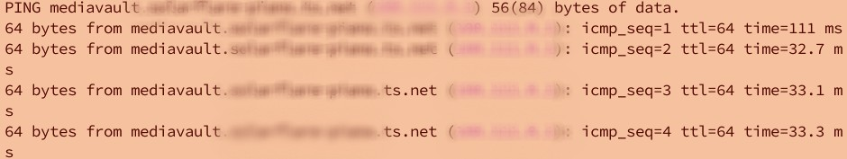

06 — MagicDNS
 
## Outcome
All tailnet devices are reachable by hostname instead of IP address.
Your droplet is accessible as `do-droplet.your-tailnet.ts.net`.
 
## Steps
 
### 1. Enable MagicDNS
Tailscale admin console → DNS → Enable MagicDNS.
 
### 2. Test hostname resolution
```bash
# From your Mac
ping do-droplet
ssh root@do-droplet
```
 
### 3. Add a custom DNS record
Admin console → DNS → Add nameserver or custom record.
Example: point `droplet` to the droplet's Tailscale IP.
 
### 4. Verify
```bash
ping droplet
```


## Troubleshooting
- **Hostname not resolving:** `tailscale dns status` to confirm MagicDNS is active
- **Custom record not working:** DNS propagation takes a moment — wait 60 seconds
